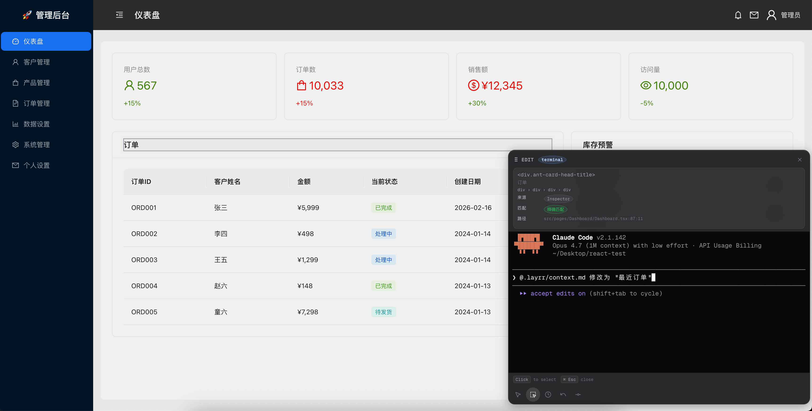

# layrr-view

> 💡 **定位**：单独使用时，本工具对开发者的吸引力有限；但它的真正价值在于作为基础设施集成到更大的场景中——例如在云端启动 dev 环境，通过 layrr-view 代理请求，即可在浏览器中实现云端代码编辑，让 AI 辅助修改能力无缝融入在线开发工作流。

<p align="center">
  <b>Point, click, and edit any web app with AI.</b>
</p>

<p align="center">
  
  
</p>

---

**layrr-view** 基于 [layrr](https://github.com/narnia-sh/layrr) 项目改造，在你的本地开发服务器前启动一个反向代理，向页面注入可视化覆盖层。你只需在浏览器中**点击页面元素**，输入自然语言修改指令，AI Agent 就会自动定位源码并完成修改。每一轮编辑都会自动生成 Git commit，支持预览、回退和恢复。

> 💡 **推荐**：安装 [code-inspector-plugin](https://github.com/zh-lx/code-inspector) 可以显著提高组件源码定位的精确率，让 AI 编辑更准确地命中目标代码。

## 工作原理

```text
┌──────────────────────────────────────────────────────┐
│                     你的浏览器                         │
│                                                      │
│  ┌─────────────────┐   ┌──────────────────────────┐  │
│  │   你的 Web 应用   │   │  layrr-view Overlay（注入）│  │
│  │  (React/Vue/...) │   │  点击元素 → 输入指令 → 发送 │  │
│  └─────────────────┘   └──────────┬───────────────┘  │
└───────────────────────────────────┼──────────────────┘
                                    │ WebSocket
┌───────────────────────────────────┼──────────────────┐
│                        layrr-view 进程                │
│                                   ▼                   │
│  ┌──────────┐  ┌──────────┐  ┌──────────────────┐   │
│  │ 反向代理  │  │ 源码定位  │  │   AI Agent       │   │
│  │ + 注入   │→│ 6 种策略  │→│ Claude/Codex/    │   │
│  │          │  │          │  │ PiMono           │   │
│  └──────────┘  └──────────┘  └────────┬─────────┘   │
│                                       │ 直接改文件    │
│                              ┌────────▼─────────┐   │
│                              │  Git 自动提交      │   │
│                              └──────────────────┘   │
└──────────────────────────────────────────────────────┘
```

## 特性

- 🎯 **可视化编辑** — 在真实页面上点击元素，所见即所得
- 🤖 **多 Agent 支持** — Claude Code、Codex CLI、Pi Mono
- 📂 **自动源码定位** — 6 种策略从 DOM 回溯到源码位置
- 🔄 **多元素批量编辑** — 一次选中多个元素，统一修改
- 📝 **自动 Git 提交** — 每轮编辑自动生成 `[layrr]` 前缀的 commit
- ⏪ **预览与回退** — 支持 preview、restore、revert 操作
- 🖥️ **内置终端** — 集成 xterm.js，可在浏览器中直接操作 Agent
- 🔗 **HMR 兼容** — 不破坏你项目的热更新

## 快速开始

### 前提条件

- Node.js >= 18
- 至少配置一个 AI Agent（见下方）

### 安装

```bash
npm install -g layrr-view
```

### 使用

1. 启动你的开发服务器（如 `npm run dev`），假设运行在 `3000` 端口
2. 在项目目录下运行：

```bash
layrr --port 3000
```

3. 浏览器会自动打开代理页面
4. 点击页面上的任意元素，输入修改指令，回车即可

```bash
# 指定 Agent
layrr --port 3000 --agent claude

# 指定代理端口
layrr --port 3000 --proxy-port 8080

# 不自动打开浏览器
layrr --port 3000 --no-open

# 指定项目目录
layrr --port 3000 /path/to/project
```

## 提高组件识别率

layrr-view 默认通过 DOM 属性和源码映射来定位组件，但对于深层嵌套或动态渲染的组件，定位可能不够精确。安装 [code-inspector-plugin](https://github.com/zh-lx/code-inspector) 可以在组件 DOM 上注入源码位置信息，大幅提升识别准确率。

### 安装方式

```bash
# 以 Vite 项目为例
npm install code-inspector-plugin -D
```

```ts
// vite.config.ts
import { codeInspectorPlugin } from 'code-inspector-plugin';

export default defineConfig({
  plugins: [
    codeInspectorPlugin({
      bundler: 'vite',
    }),
  ],
});
```

更多框架（Webpack、Rspack 等）的接入方式请参考 [code-inspector-plugin 文档](https://github.com/zh-lx/code-inspector)。

## CLI 选项

| 选项                    | 说明                              | 默认值         |
| ----------------------- | --------------------------------- | -------------- |
| `-p, --port <number>`   | 开发服务器端口（必填）            | -              |
| `--proxy-port <number>` | 代理端口                          | `4567`         |
| `--agent <name>`        | AI Agent：`claude`、`codex`       | 首次运行时选择 |
| `--mode <name>`         | 编辑 UI 模式：`panel`、`terminal` | `terminal`     |
| `--no-open`             | 不自动打开浏览器                  | `false`        |
| `-h, --help`            | 显示帮助信息                      | -              |

## AI Agent 配置

layrr-view 支持 3 种 AI Agent，你可以根据环境选择：

| Agent           | 实现方式              | 如何配置                                                        |
| --------------- | --------------------- | --------------------------------------------------------------- |
| **Claude Code** | 调用本地 `claude` CLI | `npm install -g @anthropic-ai/claude-code`，然后 `claude login` |
| **Codex CLI**   | 调用本地 `codex` CLI  | `npm install -g @openai/codex`，设置 `OPENAI_API_KEY`           |
| **Pi Mono**     | 内置 Agent SDK        | 设置 `OPENROUTER_API_KEY`                                       |

首次运行时，layrr-view 会让你选择默认 Agent，配置保存在 `~/.layrr/config.json`。你也可以通过 `--agent` 临时切换。

## 编辑流程

1. **选择元素** — 鼠标悬停高亮，点击选中（支持多选：按住 Shift 点击）
2. **输入指令** — 在底部面板输入自然语言修改意图
3. **源码定位** — layrr-view 自动从 DOM 回溯到源码文件和行号
4. **AI 执行** — Agent 读取源码上下文，执行精确修改
5. **自动提交** — 修改后的文件自动 `git commit`，格式为 `[layrr] <你的指令>`

## 开发

```bash
# 安装依赖
pnpm install

# 构建
pnpm run build

# 本地链接（开发调试）
pnpm run link:global

# 取消链接
pnpm run unlink:global
```

## License

MIT

## 与原版的差异

相比原版 layrr，layrr-view 做了以下修改：

1. **组件识别增强** — 支持 code-inspector-plugin 等源码定位插件，如果安装，会提升组件匹配精确率；匹配结果以醒目标识展示精确度，让你对定位结果心中有数。
2. **编辑过程可视化** — 代码修改过程实时可见，与终端操作 Agent 体验一致，改动内容一目了然，更适合开发人员。
3. **Git 历史全量回退** — 支持回退到任意 commit 节点，不局限于 layrr 生成的提交，版本控制更灵活。
4. **交互体验优化** — 拖拽等移动更顺滑，操作更便捷。



> ⚠️ **注意**：本版本基于原版 layrr 的某个快照改造，可能落后于原版的最新功能。如果你需要最新特性，建议前往获取最新代码，在此基础上自行修改使用。
